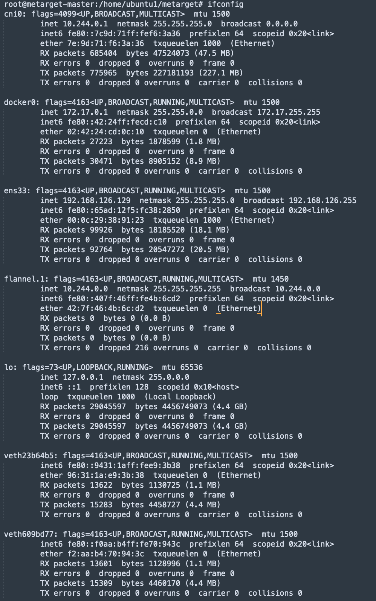
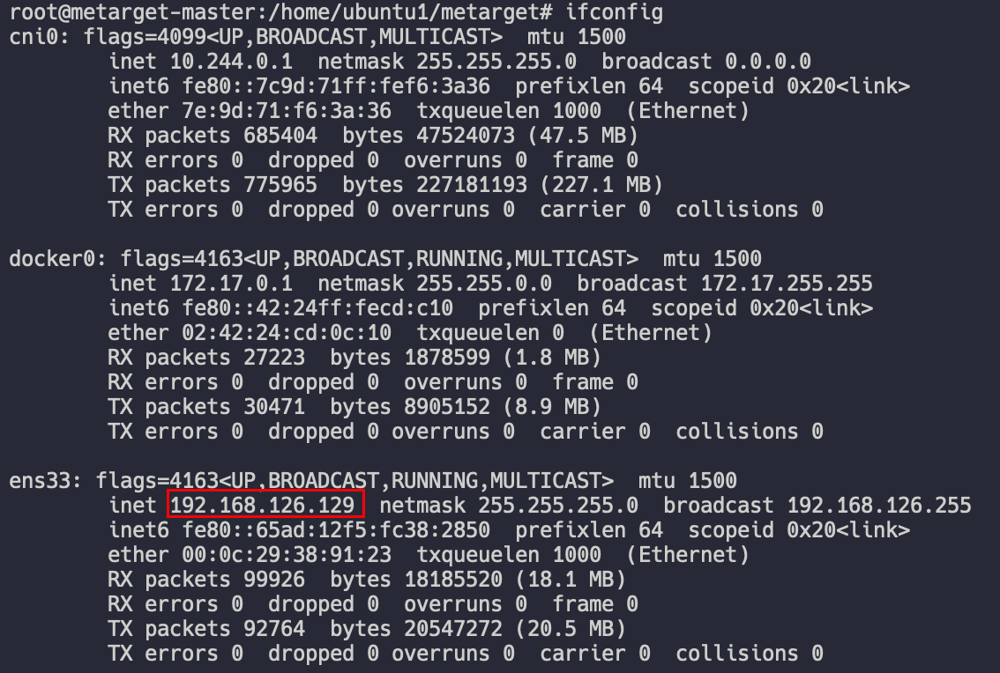
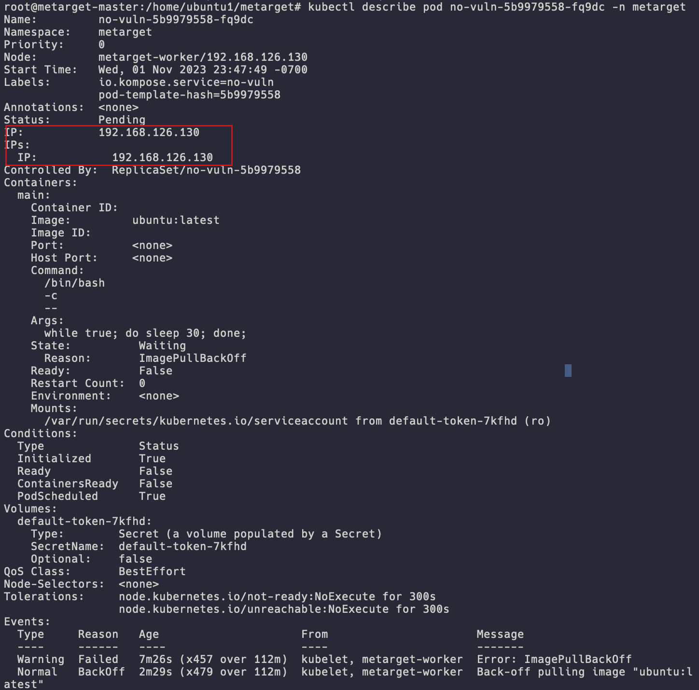

# 2023.10.23
参考链接：[Kubernetes中Pod介绍](https://blog.csdn.net/faoids/article/details/130678297)
## 0x01 Kubernetes的作用
- 管理容器化应用程序的部署、扩展和运行：容器时代与物理机时代不同，很多东西都具有可变性，如：
  - IP地址
  - 网络
  - 存储
- 跨多主机运行，利用云计算平台和虚拟化技术进行高效资源利用
## 0x02 Kubernetes常用概念
参考链接：
1. [k8s常用指令](https://blog.csdn.net/lukairui7747/article/details/130947808)
2. [kubectl cheatsheet](https://kubernetes.io/docs/reference/kubectl/cheatsheet/#bash)
附加部分：
1. kubectl:
   1. 
   2. 
   3. `kubectl auth can-i --list`：列出当前用户在集群中的RBAC权限，用于查询当前用户是否有权限执行各种操作，如创建、删除、获取资源等。
   4. `kubectl get nodes`：get status of nodes
      
   5. `kubectl version` : client version && server version 
      
2. cluster
   > Q: what is k8s cluster?
      > A: Kubernetes clusters are comprised of one master node and a number of worker nodes. These nodes can either be physical computers or virtual machines, depending on the cluster.
3. minikube
   > Q: what is minikube?
      > A: Minikube is a lightweight Kubernetes implementation that creates a VM on your local machine and deploys a simple **cluster** containing **only one node**.

## 0x03 命名空间
1. default
2. kube-node-lease
3. kube-public
4. kube-system
***
## 0x04 k8s网络插件
参考链接：[Kubernetes 之7大CNI 网络插件用法和对比](https://developer.aliyun.com/article/1245323)
k8s需要网络插件来提供集群内部和集群外部的网络通信。常用的网络插件：
1. Flannel : 常用的k8s网络插件之一，使用虚拟网络技术来实现容器之间的通信，支持多种网络后端，如VXLAN、UDP、Host-GW
2. Calico : 一种基于BGP的网络插件，使用路由表来路由容器之间的流量，支持多种网络拓扑结构，并提供安全性和网络策略功能。
3. Canal : Canal是一个组合了Flannel和Calico的网络插件，使用 Flannel 来提供容器之间的通信，同时使用 Calico 来提供网络策略和安全性功能。
4. Weave Net : Weave Net是一种轻量级的网络插件，使用虚拟网络技术来为容器提供IP地址，并支持多种网络后端，如VXLAN、UDP 和TCP/IP，同时还提供了网络策略和安全性功能。
5. Cilium : Cilium是一种基于eBPF (Extended Berkeley Packet Filter) 技术的网络插件，它使用Linux内核的动态插件来提供网络功能，如路由、负载均衡、安全性和网络策略等。
6. Contiv：Contiv是一种基于SDN技术的网络插件，它提供了多种网络功能，如虚拟网络、网络隔离、负载均衡和安全策略等。
7. Antrea : Antrea 是一种基于OVS(Open vSwitch) 技术的网络插件，它提供了容器之间的通信、网络策略和安全性等功能，还支持多种网络拓扑结构。
### 4.1 kubernetes中三种IP地址
参考链接：[k8s——三种IP地址](https://blog.csdn.net/weixin_44754964/article/details/116754287)

#### 4.1.1 Node IP 
Node节点的IP地址，即物理机（宿主机）的网卡地址
1. Node节点所在主机通过`ifconfig`查看IP地址
   
2. Node节点通过`kubectl describe node metarget-master`查看节点IP地址，发现与物理机相同
   
#### 4.1.2 Pod IP
Pod的IP地址，由docker0网卡分配
- 同Service下的pod可以直接根据PodIP相互通信
- 不同Service下的pod在集群间pod通信要借助于 cluster ip
- pod和集群外通信，要借助于node ip

通过`kubectl describe pod <podName> [-n <namespace>] `查看Pod IP地址

正常情况下，Pod IP应当为172开头，但在此处，由于在创建pod时，共享了主机的网络命名空间，因此，所查看到的Pod IP恰好为节点的IP。

#### 4.1.3 Cluster IP
可叫Service IP，Service的IP地址

## 0x05 k8s组件
参考链接：[kubernetes组件](https://kubernetes.io/zh-cn/docs/concepts/overview/components/)
1. 控制平面组件：control plane components
   1. kube-apiserver：API 服务器是 Kubernetes 控制平面的组件，该组件负责公开了 Kubernetes API，负责处理接受请求的工作。 API 服务器是 Kubernetes 控制平面的前端。
    Kubernetes API 服务器的主要实现是 kube-apiserver。kube-apiserver 设计上考虑了水平扩缩，也就是说，它可通过部署多个实例来进行扩缩。 你可以运行 kube-apiserver 的多个实例，并在这些实例之间平衡流量。
    2. etcd 一致且高可用的键值存储，用作 Kubernetes 所有集群数据的后台数据库。[Key value store of a cluster state]【a cluster brain】

    如果你的 Kubernetes 集群使用 etcd 作为其后台数据库， 请确保你针对这些数据有一份 备份计划。

***
## 0x06 k8s结构
参考视频：[Kubernetes Architecture explained](https://www.youtube.com/watch?v=umXEmn3cMWY)
### 6.1 Node processes
1. Each node has multiple pods on it
2. **3 processes** must be installed on every node
   1. container runtime
   2. kubelet : kubelet interacts with both the container and node
   3. kube proxy : forwards the requests 
3. Worker nodes do the actual work

> **_Note:_**怎样实现与集群的交互？包括以下几点：
> 1. 怎样调度每个pod？
> 2. 如果一个replica pod进程停止了，monitor是谁？
> 3. 怎样实现这个replica pod的重新调度/怎样重启这个pod？
> 4. 怎样向集群中加入一个新节点？
> 
> ==>==>==>==>==>==>
> 
> *ALL THESE MANAGING PROCESSES ARE DONE BY **MASTER NODES*** 
#### 6.1.1 Master processes
1. **4 processes** run on every master node
   1. Api server : **Load balanced** 当我们想对集群进行某些操作时，需要使用某个client客户端（k8s dashboard/k8s api）与Api server进行交互
      1. like a **cluster gateway** : gets the initial requests of any updates into the cluster or even the queries from the cluster
      2. acts as a gatekeeper for authentication : to make sure that only authenticated and authorized requests get through to the cluster
       > **_Note:_**That means whenever you want to schedule new pods; deploy new applications; create new service or any other components ====> you have to talk to the API server on the master node and the API server then validate your request and if everything is fine then it will forward your request to other processes in order to schedule the pod or create this component that you requested.
      
    2. Scheduler : Scheduler just decides on which Node new Pod should be scheduled 
     `Schedule new Pod` -> **API Server** --> **Scheduler** -> `Where to put the Pod` -> **Kubelet**
    
    3. Controller manager : detects cluster state changes
    **Controller Manager** -> **Scheduler** -> **Kubelet** -> **etcd**
    4. etcd : a key value store of a cluster state; **cluster brain**
       1. What resources are available?
       2. Did the cluster state change?
       3. Is the cluster healthy?
        > **_Note:_** Application data is **NOT** stored in etcd
### 6.2 Master节点和Worker节点
参考链接：[What is the difference between a cluster master node and a worker node in Kubernetes? How important is it to have one or more master nodes for production deployments?](https://www.quora.com/What-is-the-difference-between-a-cluster-master-node-and-a-worker-node-in-Kubernetes-How-important-is-it-to-have-one-or-more-master-nodes-for-production-deployments)
#### 6.2.1 Master节点
responsible for cluster management and for providing the API that is used to configure and manage resources within the Kubernetes cluster负责管理集群，并提供用于在k8s集群内配置和管理资源的API
1. 功能：
   1. 监视集群整体状态
   2. 编排组件之间的通信
   3. 执行整体的一些决策
2. 关键组件：
   1. API Server：暴露k8s API，充当集群管理的主要控制点
   2. Controller Manager：监控集群状态并执行自动操作，以保持用户定义的理想状态。
   3. Scheduler：根据资源可用性和限制，将工作负载（如Pod）分配给适当的工作节点。
   4. etcd：分布式键值存储，用于存储集群的配置和状态信息。
   
#### 6.2.2 Worker节点
responsible for executing your Docker containers；machines where the actual workloads, such as pods and containers, run 负责运行Docker容器
1. 功能：
   1. 存放真实的工作负载，如pods/containers。
   2. 工作负载执行master node分配的任务
2. 关键组件：
   1. Kubelet：与master node通信，管理在该节点上运行的容器
   2. Container Runtime：执行容器镜像，例如Docker/containerd
   3. Kube-proxy：处理节点上Pods之间的网络和负载均衡问题。
> **_Note:_** 在生产部署中，master节点的重要性？【由于以下几点，在生产部署中设置一个或多个master节点是非常重要的】
> 1. 高可用性：多个master节点通过提供冗余度和容错性。如果其中一个master节点出了问题，其他的master节点可以接手，防止集群管理和控制出现中断。
> 2. 集群管理：master节点负责管理集群状态，处理扩展、调度和协调工作负载分配。它们维护集群的理想状态，高效处理资源分配。
> 3. 集群扩展：master节点根据资源可用性在工作节点间分配工作负载，从而在集群扩展方面发挥重要作用。它们可优化资源利用率，确保高效的工作负载分配。
> 4. 安全和身份验证：master节点负责处理身份验证、授权和其他与安全相关的人物。它们执行策略和访问控制，确保集群内的通信安全。
> 5. 集群升级和维护：master节点通过管理新版本的推出、监控集群健康状况和执行必要的维护任务，促进集群的无缝升级和维护。
> 6. 集中控制：master节点是管理集群、做出全局决策和执行策略的集中控制点。它提供了与集群交互的统一界面。

## 0x07 Pod调度
参考链接：
1. [Kubernetes For Beginners: Taints Tolerations vs Node Affinity](https://www.youtube.com/watch?v=mB3ODCDWZIY)
2. [管理节点污点（taint）](https://www.ctyun.cn/document/10025153/10077243)
### 7.1 Taints & Tolerations 污点（容忍度）调度
#### 7.1.1 污点：Taints
污点(Taint)能够使节点排斥某些特定的Pod，从而避免Pod调度到该节点上。

节点污点是与“效果”相关联的键值对。以下是可用的效果：

- NoSchedule：不能容忍此污点的 Pod 不会被调度到节点上；现有 Pod 不会从节点中逐出。
- PreferNoSchedule：Kubernetes 会尽量避免将不能容忍此污点的 Pod 安排到节点上。
- NoExecute：如果 Pod 已在节点上运行，则会将该 Pod 从节点中逐出；如果尚未在节点上运行，则不会将其安排到节点上。
#### 7.1.2 容忍度(Toleration)
容忍度应用于Pod上，允许（但并不要求）Pod 调度到带有与之匹配的污点的节点上。

污点和容忍度相互配合，可以用来避免 Pod 被分配到不合适的节点上。 每个节点上都可以应用一个或多个污点，这表示对于那些不能容忍这些污点的 Pod，是不会被该节点接受的。
### 7.2 亲和性调度
参考链接：[Kubernetes中Pod调度第二篇NodeAffinity详解、实例](https://blog.csdn.net/u011837804/article/details/128472698)
#### 7.2.1 NodeAffinity
节点亲和性，以node为目标，解决pod可以调度到哪些node的问题
#### 7.2.2 PodAffinity
pod亲和性，以pod为目标，解决pod可以和哪些已存在的pod部署在同一个拓扑域中的问题
#### 7.2.3 PodAntiAffinity
pod反亲和性，以pod为目标，解决pod不能和哪些已存在pod部署在同一个拓扑域中的问题