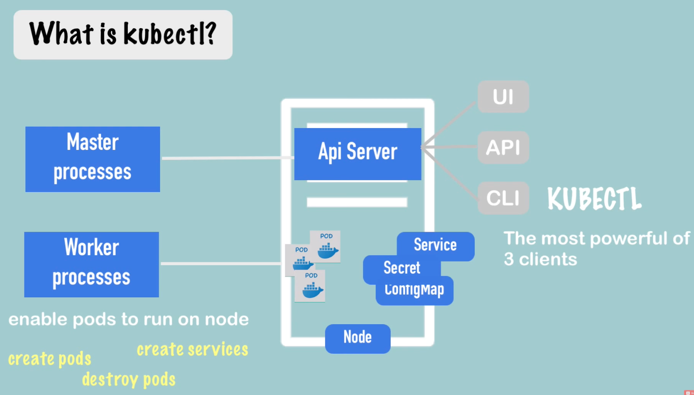
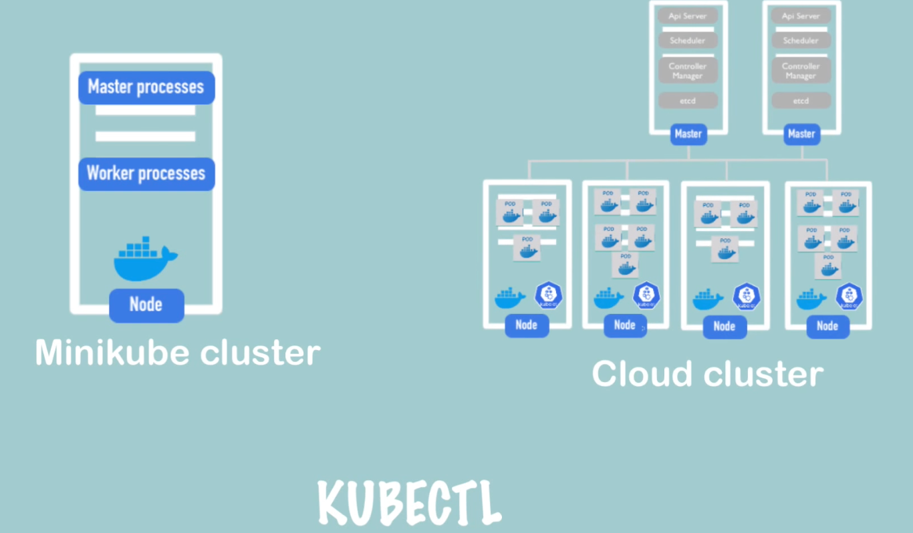

# 2023.10.23
参考链接：[Kubernetes中Pod介绍](https://blog.csdn.net/faoids/article/details/130678297)
## Kubernetes的作用
- 管理容器化应用程序的部署、扩展和运行：容器时代与物理机时代不同，很多东西都具有可变性，如：
  - IP地址
  - 网络
  - 存储
- 跨多主机运行，利用云计算平台和虚拟化技术进行高效资源利用
## Kubernetes常用指令
参考链接：[k8s常用指令](https://blog.csdn.net/lukairui7747/article/details/130947808)
附加部分：
1. kubectl:
   1. 
   2. 
   3. `kubectl auth can-i --list`：列出当前用户在集群中的RBAC权限，用于查询当前用户是否有权限执行各种操作，如创建、删除、获取资源等。
2. cluster
   > Q: what is k8s cluster?
      > A: Kubernetes clusters are comprised of one master node and a number of worker nodes. These nodes can either be physical computers or virtual machines, depending on the cluster.
3. minikube
   > Q: what is minikube?
      > A: Minikube is a lightweight Kubernetes implementation that creates a VM on your local machine and deploys a simple **cluster** containing **only one node**.
## 命名空间
1. default
2. kube-node-lease
3. kube-public
4. kube-system

## k8s网络插件
参考链接：[Kubernetes 之7大CNI 网络插件用法和对比](https://developer.aliyun.com/article/1245323)
k8s需要网络插件来提供集群内部和集群外部的网络通信。常用的网络插件：
1. Flannel : 常用的k8s网络插件之一，使用虚拟网络技术来实现容器之间的通信，支持多种网络后端，如VXLAN、UDP、Host-GW
2. Calico : 一种基于BGP的网络插件，使用路由表来路由容器之间的流量，支持多种网络拓扑结构，并提供安全性和网络策略功能。
3. Canal : Canal是一个组合了Flannel和Calico的网络插件，使用 Flannel 来提供容器之间的通信，同时使用 Calico 来提供网络策略和安全性功能。
4. Weave Net : Weave Net是一种轻量级的网络插件，使用虚拟网络技术来为容器提供IP地址，并支持多种网络后端，如VXLAN、UDP 和TCP/IP，同时还提供了网络策略和安全性功能。
5. Cilium : Cilium是一种基于eBPF (Extended Berkeley Packet Filter) 技术的网络插件，它使用Linux内核的动态插件来提供网络功能，如路由、负载均衡、安全性和网络策略等。
6. Contiv：Contiv是一种基于SDN技术的网络插件，它提供了多种网络功能，如虚拟网络、网络隔离、负载均衡和安全策略等。
7. Antrea : Antrea 是一种基于OVS(Open vSwitch) 技术的网络插件，它提供了容器之间的通信、网络策略和安全性等功能，还支持多种网络拓扑结构。

## k8s组件
参考链接：[kubernetes组件](https://kubernetes.io/zh-cn/docs/concepts/overview/components/)
1. 控制平面组件：control plane components
   1. kube-apiserver：API 服务器是 Kubernetes 控制平面的组件，该组件负责公开了 Kubernetes API，负责处理接受请求的工作。 API 服务器是 Kubernetes 控制平面的前端。
    Kubernetes API 服务器的主要实现是 kube-apiserver。kube-apiserver 设计上考虑了水平扩缩，也就是说，它可通过部署多个实例来进行扩缩。 你可以运行 kube-apiserver 的多个实例，并在这些实例之间平衡流量。
    2. etcd 一致且高可用的键值存储，用作 Kubernetes 所有集群数据的后台数据库。

    如果你的 Kubernetes 集群使用 etcd 作为其后台数据库， 请确保你针对这些数据有一份 备份计划。

