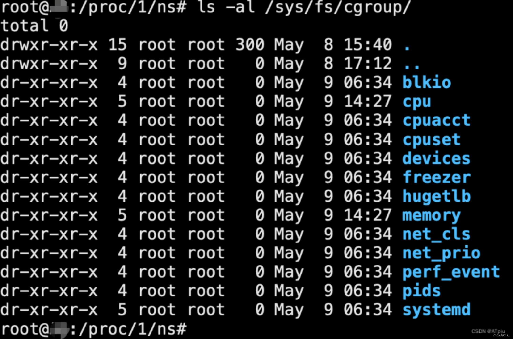

# 2023.08.24

## 0x01 虚拟化与容器技术
虚拟化技术是一种将计算机物理资源（CPU提供的运算控制资源、硬盘提供的数据存储资源、网卡提供的网络传输资源等硬件资源）进行抽象、转换为虚拟的计算机资源从而提供给程序使用的技术。利用虚拟化技术，我们可以提高计算机资源使用率，使得计算机资源不被浪费。

### 1.1 虚拟机（VM）
通过一个虚拟机监视器（Virtual Machine Monitor，同Hypervisor）来隔离操作系统（OS）与硬件或者应用程序与操作系统，以此达到虚拟化的目的。虚拟机可以将一台服务器变成多台服务器，Hypervisor层允许在一台机器上运行多个VM。每个VM都包括操作系统、应用程序、必要的二进制文件和库，一般占用数十GB空间。虚拟机启动速度很慢，性能低下。
虚拟化的重要实现：用来搭建虚拟操作系统环境的VMware Workstation、Xen等软件，Java虚拟机JVM，PHP虚拟机HHVM等。

### 1.2 容器（Container）技术
更轻便与高效的虚拟化技术，在操作系统层面实现了对计算机系统资源的虚拟化，在操作系统中通过对CPU、内存和文件系统等资源进行隔离、划分和控制，实现进程间透明的资源使用。在容器中，代码、运行时和各种依赖与配置被打包在一起，多个容器可以在同一台机器上运行，并与其他容器共享操作系统内核。每个容器在用户空间中作为独立进程进行。与VM相比，容器占用的空间更小（容器镜像一般大小为几十MB），并且由于没有虚拟操作系统和hypervisor这两个层次，应用程序运行所带来的额外消耗大幅减少。

<u>虚拟机自带操作系统（可以与宿主机一样，可以不一样）；容器与宿主机共享一个操作系统。</u>

不同点|容器|虚拟机
-|-|-
启动速度|秒级|分钟级
运行性能|接近原生|50%左右损失
磁盘占用|MB|GB
数量|成百上千|一般几十台
隔离性|进程级别|系统级别（更彻底）
操作系统|主要支持Linux|几乎所有
封装程度|只打包项目代码和依赖关系，共享宿主机内核|完整的操作系统，与宿主机隔离

#### 1.2.1 Docker底层技术
Docker使用Go语言编写，并用到了Linux内核的多项功能，如**cgroup（control group）**，**namespace**等（因此Docker是运行于Linux之上的，当在Windows或MacOS上使用Docker，实际上是运行在一个“隐藏的Linux”之上）。

Docker使用Linux内核提供的一种名为namespace（命名空间）的技术来创建容器。当运行一个容器时，Docker会为这个容器创建一组命名空间。这些命名空间提供了一层隔离，Docker引擎使用了pid、net、ipc、mnt、uts命名空间。Docker容器本质上是由一组互相重叠的层所组成的，然后容器引擎将其合并到一起，这些层都是只读的。
1. pid命名空间：进程隔离（PID：Process ID）
2. net命名空间：管理网络接口（NET：Networking）
3. ipc命名空间：管理对IPC资源的访问权限（IPC：InterProcess Communication）
4. mnt命名空间：管理文件系统挂载点（MNT：Mount）
5. uts命名空间：隔离内核和版本标识符（UTS：Unix Timesharing System）

#### 1.2.2 cgroup和namespace：
- cgroup支持了对于进程资源的使用限制
- namespace提供了对进程资源的隔离限制

[Docker常用指令](http://wiki.op81.com/pages/9e1b52/)
##### 1.2.2.1 cgroup
参考链接：[红队视角下的容器逃逸利用及分析](https://blog.csdn.net/w1590191166/article/details/125348762)

cgroup：`control group`的简称，又称控制组，主要做资源控制，属于linux内核提供的一个特性。其原理是将一组进程放在一个控制组里，通过给这个控制组分配指定的可用资源，达到控制这一组进程可用资源的目的。

CGroup有以下几个基本概念：
1. task（任务）：对应于系统中运行的一个实体
2. subsystem（子系统）：，具体的资源控制器，控制某个特定的资源使用
3. hierarchy（层级树）：由一系列`CGroup`组成的树形结构。每个节点都是一个 `CGroup` ，`CGroup` 可以有多个子节点，子节点默认会继承父节点的属性。系统中可以有多个 `hierarchy`。

Cgroup中部分常见子系统如下：

我们可通过`ls -al /sys/fs/cgroup/`查看当前系统`cgroup`

## 0x02 容器安全
容器环境，或者叫容器云，其本质是云计算的一种实现方式，我们可以将其称为Paas或者CaaS。 容器技术是云原生体系的底层，因而容器安全也是云原生安全的基石。事实上容器逃逸比虚拟机逃逸容易很多，所以容器环境的安全是云原生安全的重中之重。

总体而言，容器层面的安全可以分为以下几部分。

- **容器环境基础设施的安全性**，比如主机上的安全配置是否会影响到其上运行的容器，主机上的安全漏洞和恶意进程是否会影响到容器，容器内的进程是否可以利用主机上的安全漏洞，等等。
- **容器的镜像安全**，包括镜像中的软件是否存在安全漏洞，镜像在构建过程中是否存在安全风险，镜像在传输过程中是否被恶意篡改，等等。
- **容器的运行时安全**，比如运行的容器间的隔离是否充分，容器间的通信是否是安全的，容器内的恶意程序是否会影响到主机或者其他容器，容器的资源使用情况是否安全，等等。
- **整个容器生态的安全性**，比如 Docker 自身的安全性如何， Service Mesh/Serverless对容器安全有什么影响，容器中安全密钥的管理与传统环境有什么不同，容器化后的数据隐私保护与传统的数据隐私保护是否一致，等等。

### 2.1 Docker的安全机制
- Linux Capability
  - Docker默认对User Namespace不进行隔离，在容器内部会发现uid为0，即容器内部的root其实为宿主机root。但很多操作不能进行，这是通过Linux Capability实现的
  - Linux Capability打破了操作系统中超级用户和普通用户的概念，普通用户通过设置Capability也可以实现超级用户的某些操作
  - Linux Capability共38种，docker默认开启14种，可有效避免很多安全问题。如果运行容器时使用了--privileged=true选项，那么就是开启了全部的capability
- AppArmor
- SELinux
- Seccomp

* * *
## 0x03 参考资料
1. [云原生安全](https://github.com/Metarget/cloud-native-security-book/tree/main)
2. [容器技术](https://github.com/Metarget/cloud-native-security-book/blob/main/appendix/200_容器技术.pdf)
3. [Docker学习笔记](https://cloud.tencent.com/developer/inventory/5311/article/1388152)
4. [容器是什么](https://www.docker.com/resources/what-container/)
5. [Docker](https://docs.docker.com/get-started/overview/#the-underlying-technology)
6. [Docker安全](https://blog.csdn.net/m0_73459977/article/details/128997919)

## 0x04 参考视频：
1. [Introduction to Docker for CTFs](https://www.youtube.com/watch?v=cPGZMt4cJ0I&t=0s)
2. [How Docker Works - Intro to Namespaces](https://www.youtube.com/watch?v=-YnMr1lj4Z8&list=PLhixgUqwRTjxtDt2ABuejRxrIFSroqyEY&index=4&t=6s)