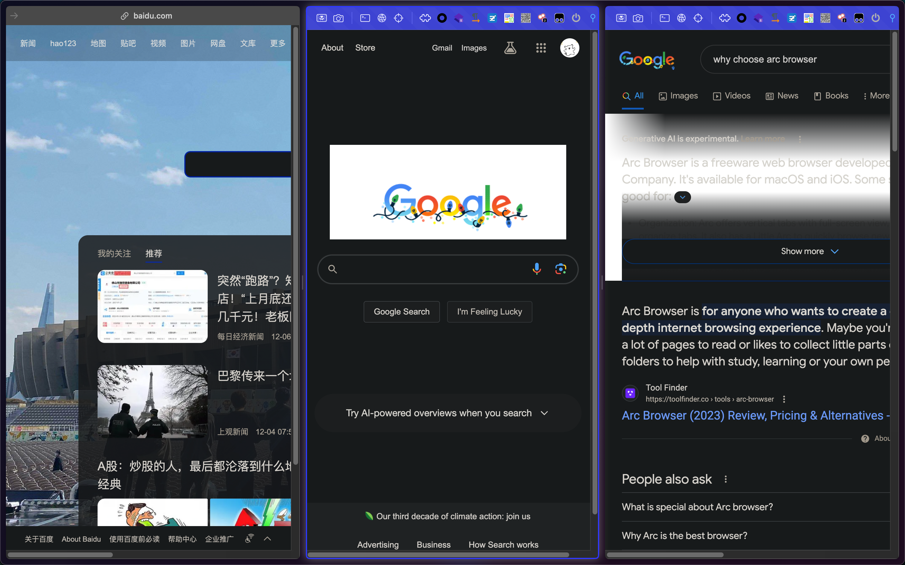
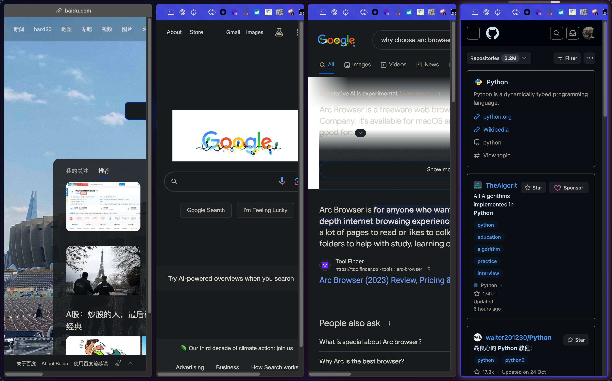

# 2023-12-08 10:46:33
1. 基于chrome开发，能用所有chrome上的插件
2. 标签页栏在左侧，可以更直观的查找某个tab
   
3. 可以创建多个space，例如个人空间、工作空间、其他空间等。
   
4. 平时使用可以隐藏tab栏，全屏显示页面内容。
   - 显示url栏
   
   - 隐藏url栏
    
5. 含有内置split view，可以快捷打开多个页面。
   - 同时打开两个标签页
    
   - 同时打开三个标签页
    
   - 同时打开四个标签页
    
6. cmd+t直接搜索新的标签页，或切换到某个tab
7. 