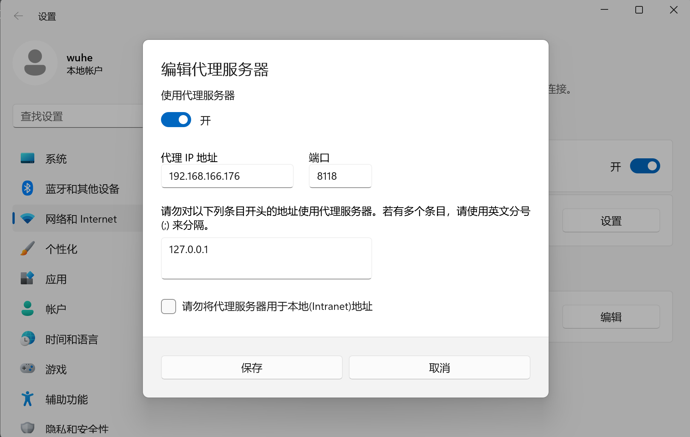

# 2023.10.19
参考链接：[设置Parallels Desktop中的虚拟机使用宿主机代理](https://blog.csdn.net/u011195398/article/details/85791354)
## 原理

[{Post:虚拟机三种网络模式]()

## 设置代理
### Ubuntu主机
- 系统为MacOS，使用的代理软件为[MonoProxy](https://storage.monocloud.co/client/MacOS/MonoProxyMac%200.7.2.dmg)，参考使用手册:[使用手册](https://mymonocloud.com/knowledgebase/11)。其他代理软件的设置也类似。
1. 在宿主机上设置代理客户端**允许局域网访问**
   1. 设置HTTP代理监听地址为`0.0.0.0`，端口不需要更改。
   2. 设置SOCKS5代理监听地址为`0.0.0.0`，端口不需要更改。
   
2. 设置虚拟机的网络连接模式为`桥接模式`，让虚拟机和宿主机近似连接在同一个交换机上，处于同一个LAN中。
    
3. 查看虚拟机IP地址
    
4. 核对宿主机IP地址
    
5. 设置虚拟机网络代理
    
6. 大功告成！
    

### Windows主机
原理与上类似，需要再次确认monoProxy客户端中的config中监听地址是否仍为0.0.0.0，若发生改变，需要更改回这个值。

前往该页面，将代理服务器相关设置改为如图，即可完成代理设置。
