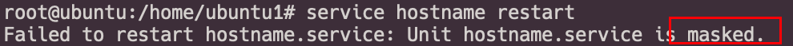
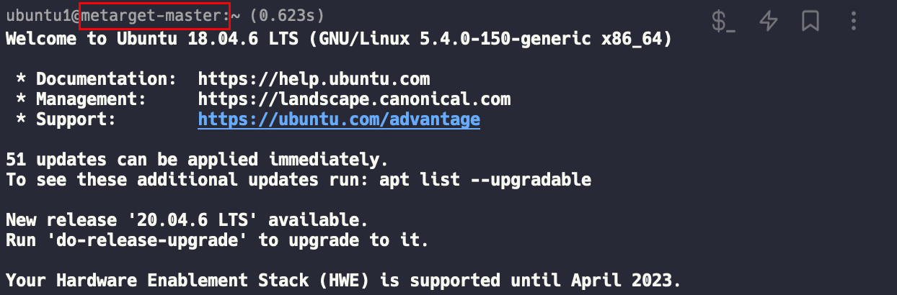

# 2023-10-31 10:15:18
## 0x01 初次尝试不重启机器
1. 首先使用`hostname`指令查看当前主机名。
2. 修改`/etc/hostname`与`/etc/hosts`文件中的当前主机名为新主机名
3. 重启`hostname`主机名服务
   
   出现错误
   
## 0x02 重启主机
1. 使用`hostname new-hostname`手动更改主机名
2. 修改`/etc/hostname`和`/etc/hosts`文件
3. 重启主机`reboot`，成功修改
   