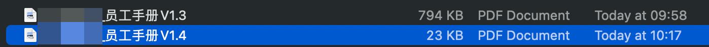
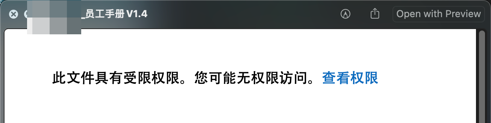
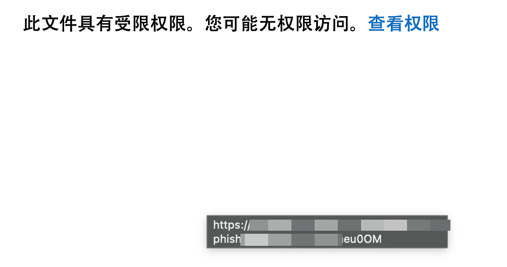
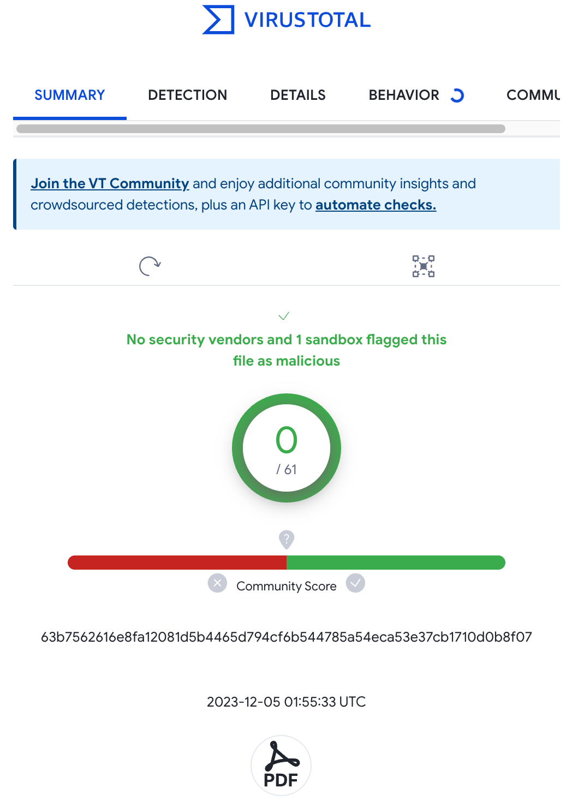
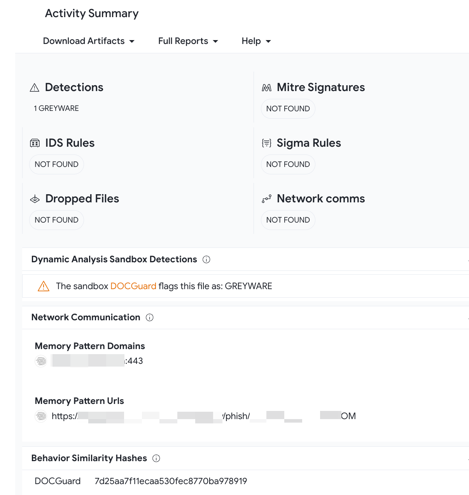

# 2023-12-05 10:13:35
昨天在看公司的产品demo视频，周老师很仔细地讲了钓鱼邮件模块，突然就很想看看之前ry搞的钓鱼邮件究竟内含什么玄机。看到现在，果然学到了很多东西。

我总共收到过三次钓鱼邮件，第一次是中秋礼品免费领取通知，里面有一个按钮可以填写收货地址；第二封也是中秋节礼品领取，但是不知道为啥标题就写的钓鱼链接🎣哈哈哈；第三封特别真，是在hr更新员工手册后几天发送的，正文也是说对某某条进行了修改。很真，真的很真。

公司平台的钓鱼邮件模块需要在创建任务时设置一个期限，只有在这个期限内的上钩点击才会被记录在案，参与最终的统计。由于钓鱼邮件的任务早就结束了，我就打开那个pdf浅浅看了一下，这个pdf有好几个特别奇怪的地方。
1. 文件大小特别小
   
2. 发送者名称为“人力资源部”，公司的HR发邮件一般就叫HR，从没听说过人力资源部这个叫法。
3. 发送者地址没有公司域名，叫`hr@company.com`，这就很奇怪了哈哈哈。

## 0x01 邮件头信息

## 0x02 灰色软件
参考链接：[灰色软件](https://upimg.baike.so.com/doc/10024035-10371989.html)

附件的pdf现在打开是这样的。并且鼠标在其中整个页面上都是小手状态，悬浮会出现一个url，里面居然直接就有`phish`字眼！！！

由于期限已经过了，所以无法再通过点击验证，链接已经失效，于是就在`virustotal`网站上传了这个文件进行扫描。扫描结果如下，有一个沙箱将其定义为灰色软件：

> 灰色软件，Greyware or Grayware，泛指所有不被认为是电脑病毒或木马程序，但会对你所在机构的网络上所使用的电脑的效能造成负面影响、并引致网络的保安受损的软件。

   