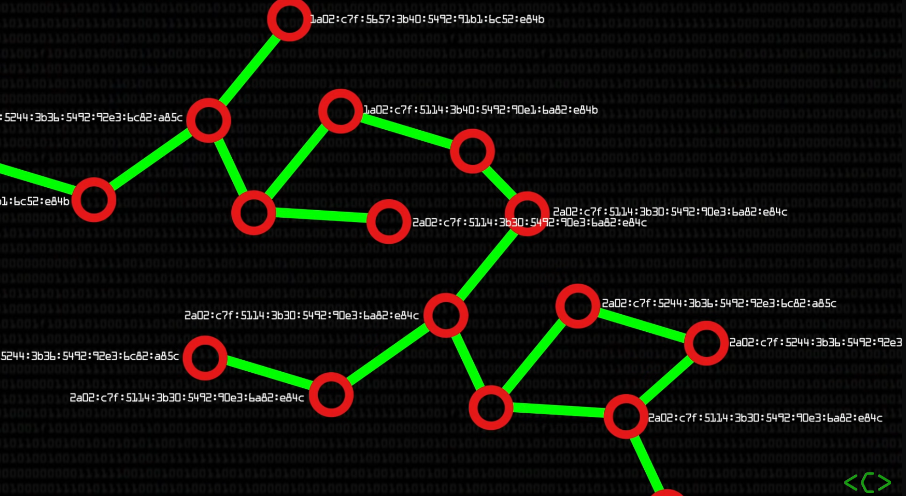
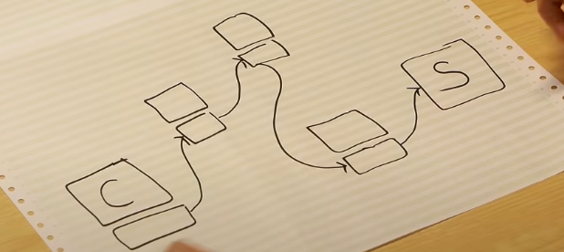
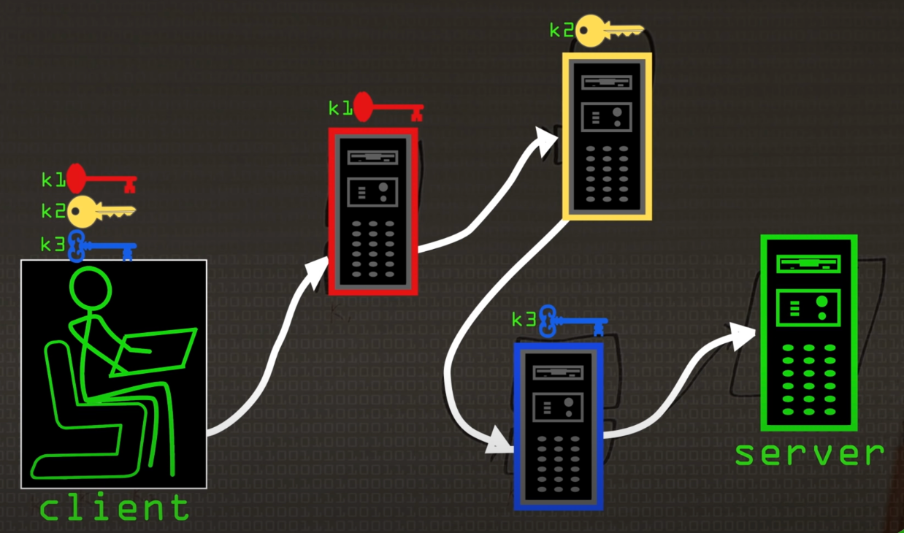
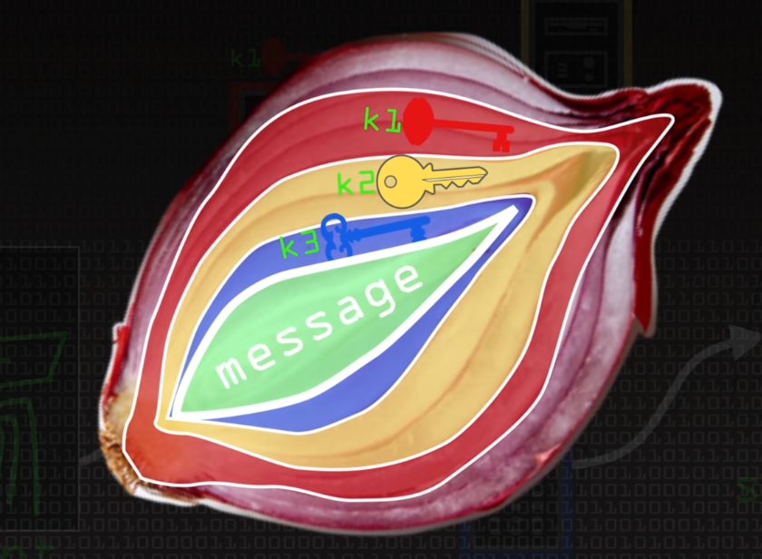
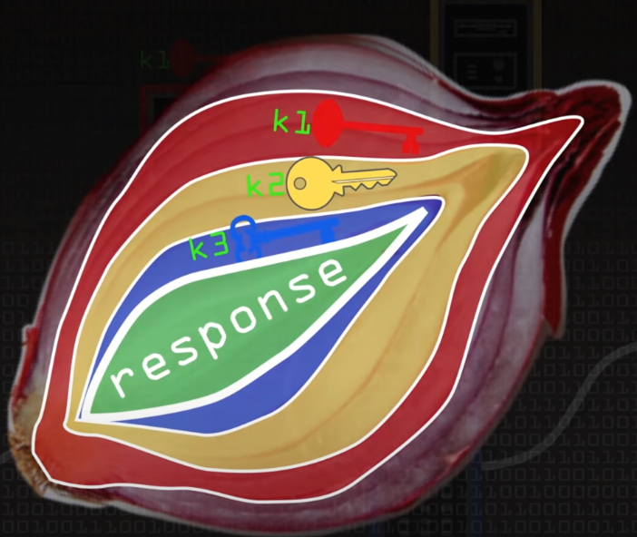
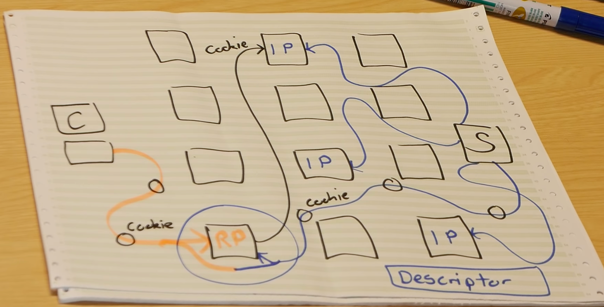

# 2023-12-19 14:02:40
为什么？为什么？为什么computerphile里的人解释东西都这么清晰还有意思？？？？啥时候我能成为这样的人呢
参考视频：
1. [Web vs Internet (Deep Dark Web Pt1) - Computerphile](https://www.youtube.com/watch?v=oiR2mvep_nQ)
2. [Secrets of the Deep Dark Web (Deep Dark Web Pt2) - Computerphile](https://www.youtube.com/watch?v=joxQ_XbsPVw)
## 暗网vs互联网
1. Internet互联网是将全世界所有机器能连到一起的物理连接 physical connections
   
2. web是运行在互联网上的应用程序之一，用来共享一些信息，其他的software还包括email exchange, file transfer protocol，使用web浏览器可以view the web
### Deep Web ｜ Dark Web
1. Deep web：与普通web一样，只是不被暴露在互联网如google上
2. Dark Web：另一种web，匿名性更强，更私密，使用不同方式运作

参考视频：[How TOR Works-Computerphile](https://www.youtube.com/watch?v=QRYzre4bf7I)

参考链接：[Tor](https://seon.io/resources/dictionary/tor/#:~:text=Onion%20services%2C%20also%20known%20as,including%20to%20the%20Tor%20network.)
## Tor协议
Tor(The Onion Router)洋葱路由协议是由美国海军研究实验室开发的，设计目的是保护网络通信的隐私和匿名性。

Tor是一个用于匿名化网络通信的工具和网络协议。它通过在互联网上建立多层加密（类似于洋葱）和隧道路由来隐藏用户的真实身份和位置信息。Tor通过将用户的通信流量经过多个中间节点（也称为中继）进行随机路由，使得追踪用户的来源和目的地变得困难。

与保密性不同，保密性是指，当有人看到了我们发送的信息时，我们不希望这条信息是可读的；但在Onion Routing这里，我们希望的是其他人不能看到我们发送了信息。

## 多层加密 General Idea
1. 单层加密：作用不大
   
2. 因此我们需要多层加密：其中使用到密钥交换算法（如DDiffie-Hellman，DH密钥交换算法）
   
   1. 如果使用K1加密了某些东西，只有第一个router可以看到
   2. 如果使用K2加密了某些东西，只有第二个router可以看到
   3. 如果使用K3加密了某些东西，只有第三个router可以看到
3. Tor发送的信息是经过了多层加密的，也就是说，client发送的信息经过了k1、k2、k3三层加密。
   
   1. 经过router1时，会用k1解密第一层
   2. 经过router2时，会用k2解密第二层
   3. 经过router3时，会用k3解密第三层
4. 从server端返回信息时过程相同
   1. 经过router3时，使用k3加密第一层
   2. 经过router2时，使用k2加密第二层
   3. 经过router1时，使用k1加密第一层
        
> **_Note:_** 多层加密不会改变文件大小
> Tor消息被称为cells，他们保持512字节的长度。
> 每一层的加密会被放在hash或digest中，在消息尾部
