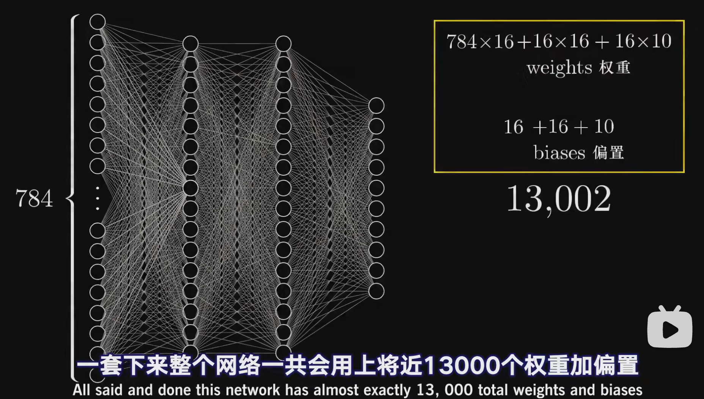

# 2023-12-20 18:17:05
## 0x01 AI领域前置知识
参考链接：
1. [先知安全沙龙（长沙站）- AI时代-阿里云大模型攻防实践](https://xz.aliyun.com/t/13189)
2. 可参考文末的思维导图
3. [secgpt github](https://github.com/Clouditera/secgpt)
   [secgpt模型下载](https://huggingface.co/w8ay/secgpt)
   [SecGPT：全球首个网络安全开源大模型](https://mp.weixin.qq.com/s/LT4n1tbWGRXz44rme82fig)
4. [huggingface镜像网站模型下载](https://hf-mirror.com/w8ay/secgpt)
5. [GPTSecurity](https://github.com/mo-xiaoxi/GPTSecurity)
6. [《动手学深度学习》](https://zh-v2.d2l.ai/#)
7. [【官方双语】深度学习之神经网络的结构 Part 1 ver 2.0](https://www.bilibili.com/video/BV1bx411M7Zx/?vd_source=6671d33bcf63c21d36edfa9a8e5b473e)
8. [【官方双语】深度学习之梯度下降法 Part 2 ver 0.9 beta](https://www.bilibili.com/video/BV1Ux411j7ri/?vd_source=6671d33bcf63c21d36edfa9a8e5b473e)
9. [Gradient-Descent (梯度下降，优化函数大法)](https://mp.weixin.qq.com/s/EXumVg7EPcl0ZeRVeUk82g)
10. [深度学习笔记](https://github.com/AccumulateMore/CV)
11. [芯片性能对比](https://mlcommons.org/benchmarks/training/)
12. [CPU vs GPU vs TPU vs DPU vs QPU](https://www.bilibili.com/video/BV1S14y1k72N/?vd_source=6671d33bcf63c21d36edfa9a8e5b473e)
学习的本质：找到正确的权重和偏置值，因为每一层的所有神经元都需要与下一层的所有神经元连接，需要对大量的权重和偏置值进行调整，才能最终获得期望的结果。

## 0x02 初期直接在内网服务器尝试模型训练遇到的一些坑
1. 