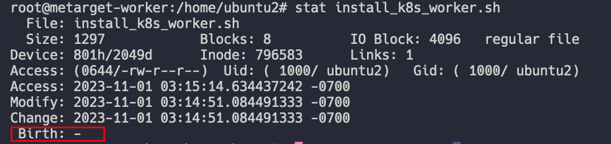
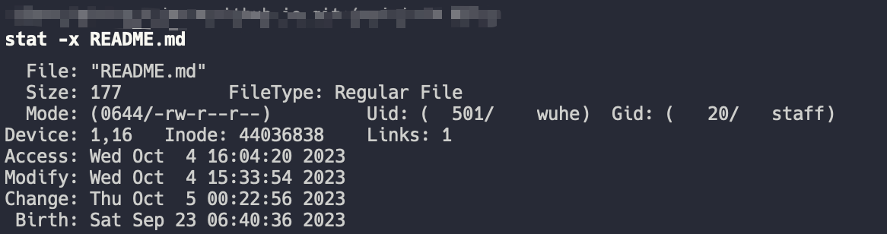

# 2023-11-02 10:43:06
## 0x01 Unix系统中有关时间戳的信息
参考链接：
1. [Get file created/creation time? [duplicate]](https://unix.stackexchange.com/questions/24441/get-file-created-creation-time)
2. [Output of stat on OSX](https://unix.stackexchange.com/questions/175325/output-of-stat-on-osx)
### 1.1 Linux系统
Linux系统为文件提供三种时间戳

1. time of last access of contents (atime)
2. time of last modification of contents (mtime)
3. time of last modification of the inode (metadata, ctime)
4. 如果文件的`Birth`栏为空，那么可以参考此链接，或许能查看到[Birth is empty on ext4](https://unix.stackexchange.com/questions/50177/birth-is-empty-on-ext4/50184#50184)
### 1.2 MacOS
MacOS上查看文件创建时间可以直接使用`stat -x <filename>`
