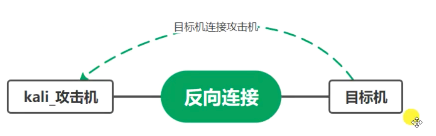

# 2023.10.08

## 内网代理与隧道

### 代理
解决不出网的问题，比如A主机在外网，B主机在内网，这时就需要将A主机当作跳板去访问B主机。

#### 转发
端口转发，也是解决访问问题，只不过是将某一个端口转发到外网服务器上。

### 隧道
解决协议问题，比如禁用了http或者tcp协议，这时就只能使用icmp等一些底层协议。

> **_Question:_**  在内网渗透中，该如何选择代理方式及隧道方式？

***
### 正向马、反向马
#### 正向马（bind shell）
攻击端主动连接目标机，常用于**内网渗透**中
> **_Attention:_**  这种情况下，Kali攻击机可以出网，但目标主机不能出网


#### 反向马（reverse shell）
目标机主动连接攻击端，常用于目标主机在外网中，比如：一句话木马
> **_Attention:_**  这种情况下，目标机可以出网，但kali攻击机不能出网


*** 
### Cobalt Strike的部署及使用
hacker ----> 服务器（cs部署在外网） ----> 受害机

```bash
# 服务器端
sudo ./teamserver 服务器IP password 
# 客户端 kali linux
./start.sh # 弹出窗口后输入服务器ip地址，可修改端口，用户名，密码为服务器端启动时的password

# 客户端 windows
## 双击运行start.bat
```

### Cobalt Strike生成windows木马，生成linux木马
> **_Attention:_**  外网的环境暂时不会弄代理，现在

### Metasploit生成windows正向反向木马，Linux正向反向木马