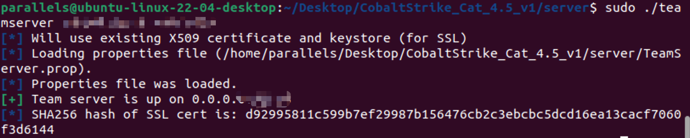

# 2023.10.09
## 0x01 SSL证书中的keystore是什么
### 1.1 SSL协议
SSL安全协议：Secure socket layer(SSL)，用来提供对用户和服务器的认证，对传送的数据进行**加密和隐藏**，确保数据在传输中不被改变，即**数据的完整性**
#### SSL证书
SSL证书是数字证书的一种，类似于驾驶证、护照和营业执照的电子副本。因为配置在服务器上，也称为SSL服务器证书。

SSL证书就是遵守 SSL协议，由受信任的数字证书颁发机构CA，在验证服务器身份后颁发，具有服务器身份验证和数据传输加密功能。

> **_Note:_** SSL证书在客户端浏览器和web服务器之间建立一条SSL安全通道

### 1.2 keystore
java密钥库，用来进行通信加密，比如数字签名。keystore用来保存密钥对，比如公钥与私钥。

#### keystore中包含两种数据
- 密钥实体(key entity)： 密钥(secret key)和私钥与与之配对的公钥(采用非对称加密)
- alias(别名)：每个keystore都关联这一个独一无二的alias，这个alias通常不区分大小写

[JDK中keytool常用命令参考](https://blog.csdn.net/wecloud1314/article/details/123042277)
***
## 0x02 Keystore password is incorrect
今天在使用cs_cat的时候再次遇到了这个问题，第一次遇到这个问题是在公网服务器上部署cs服务端的时候，但当时解决得比较混乱，也居然没有做任何笔记。。。今天沉下心来好好分析了一下问题，并结合公网服务器的history历史指令进行分析后，发现原来思路很清晰。

### 1.3 公网ubuntu上次解决这个问题的历史指令一角


### 1.4 本次解决问题思路
1. 首先看明白这个keystore究竟是个什么东西
2. 查找一些资料，理解这个问题所在，其实非常简单，就是字面上写的“密钥库密码不正确”，毫无复杂之处。
3. 分析上次的历史指令后，发现应当需要重新生成一个密钥库。删除原本的密钥库，使用<code>keytool</code>生成一个新的密钥库，名字依然为<code>cobaltstrike</code>。
    ```bash
    keytool -keystore ./cobaltstrike.store -storepass 123456 -keypass 123456 -genkey -keyalg RSA -alias cobaltstrike -dname "CN=*.microsoft.com, OU=Microsoft Corporation, O=Microsoft Corporation, L=Redmond, S=WA, C=US"
    ```
4. 观察公网服务器上的`CatServer.properties`文件
   
5. 对比当前虚拟机上的`CatServer.properties`文件
   
6. 得出就是这里的问题，将此处的`CatServer.store-password`改为之前创建时的密码即可
   

> **_Note:_** CobaltStrike_Cat_4.5_v1中的teamserver密码不是在执行脚本的时候设置，而是在server/CatServer.properties文件中设置好的，因此执行脚本时不需要再给予密码，直接在客户端使用CatServer.properties文件中的密码即可
> 