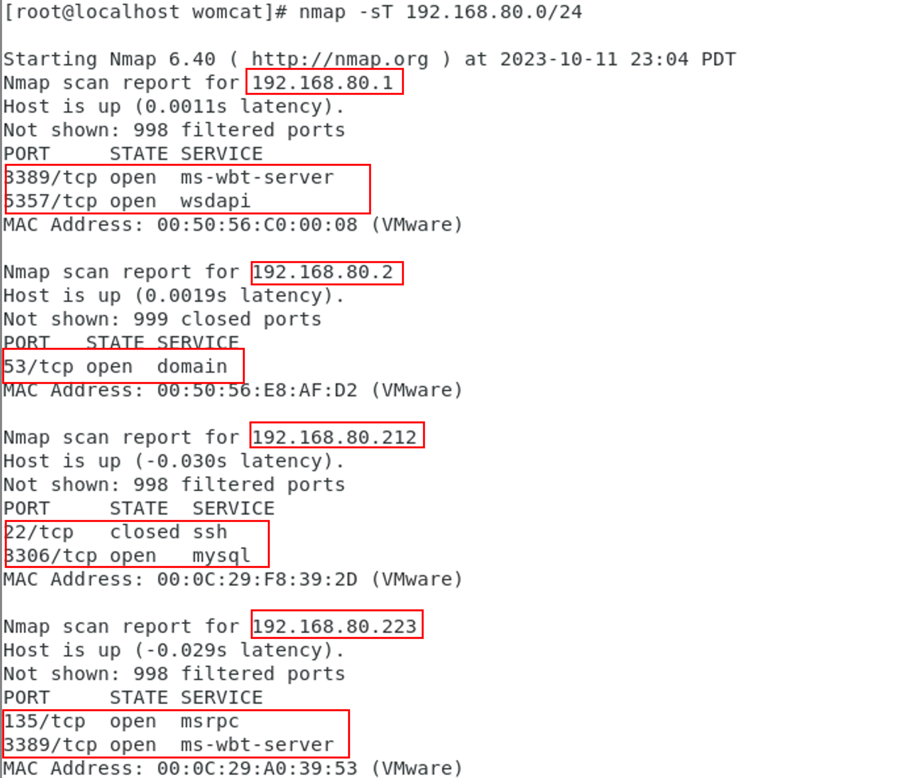
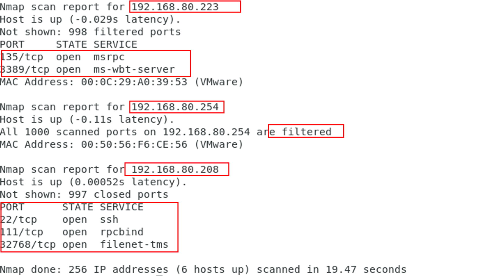

# 2023.10.12
## 0x01 nmap简介
nmap(network mapper)，网络扫描和嗅探工具包，是一个网络连接端扫描软件，用来扫描网上电脑开放的网络连接端，确定哪些服务运行在哪些连接端，并且推断计算机运行哪个操作系统(fingerprinting)。
[nmap-cheatsheet](https://www.stationx.net/nmap-cheat-sheet/)
## 0x02 基本功能
1. 探测一组主机是否在线
2. 扫描主机端口，嗅探所提供的网络服务
3. 推断主机所用的操作系统
### 2.1 具体使用举例
1. `nmap -sP 192.168.1.0/24`:
   
   进行ping扫描，打印出对扫描做出响应的主机,不做进一步测试(如端口扫描或者操作系统探测)
2. `nmap -sL 192.168.1.0/24`
   
   仅列出指定网络上的每台主机，不发送任何报文到目标主机
3. `nmap -PS 192.168.1.234`
   
   探测目标主机开放的端口，可以指定一个以逗号分隔的端口列表(如-PS22，23，25，80)
4. `nmap -PU 192.168.1.0/24`
   
   使用UDP ping探测主机
5. `nmap -sS 192.168.1.0/24`
   
   使用频率最高的扫描选项：SYN扫描,又称为半开放扫描，它不打开一个完全的TCP连接，执行得很快
6. `nmap -sT 192.168.1.0/24`
   
   当SYN扫描不能用时，TCP Connect()扫描就是默认的TCP扫描
7. `nmap -sU 192.168.1.0/24`
   
    UDP扫描用-sU选项,UDP扫描发送空的(没有数据)UDP报头到每个目标端口
8. `nmap -sO 192.168.1.19`
   
   确定目标机支持哪些IP协议 (TCP，ICMP，IGMP等)
9.  `nmap -O 192.168.1.19`
    `nmap -A 192.168.1.19`
    
    探测目标主机的操作系统
10. `nmap -v scanme.`
    
    扫描主机scanme中 所有的保留TCP端口。选项-v启用细节模式
11. `nmap -sS -O scanme./24`
    
    进行秘密SYN扫描，对象为主机Scanme所在的“C类”网段 的255台主机。同时尝试确定每台工作主机的操作系统类型。因为进行SYN扫描 和操作系统检测，这个扫描需要有根权限
12. `nmap -sV -p 22，53，110，143，4564 188.116.0-255.1-127`
    
    进行主机列举和TCP扫描，对象为B类188.116网段中255个8位子网。这 个测试用于确定系统是否运行了sshd、DNS、imapd或4564端口。如果这些端口 打开，将使用版本检测来确定哪种应用在运行。
13. `nmap -v -iR 100000 -P0 -p 80`
    
    随机选择100000台主机扫描是否运行Web服务器(80端口)。由起始阶段 发送探测报文来确定主机是否工作非常浪费时间，而且只需探测主机的一个端口，因 此使用-P0禁止对主机列表。
14. `nmap -P0 -p80 -oX logs/pb-port80scan.xml -oG logs/pb-port80scan.gnmap 216.163.128.20/20`
    
    扫描4096个IP地址，查找Web服务器(不ping)，将结果以Grep和XML格式保存
15. `host -l | cut -d -f 4 | nmap -v -iL -`
    
    进行DNS区域传输，以发现中的主机，然后将IP地址提供给 Nmap。上述命令用于GNU/Linux -- 其它系统进行区域传输时有不同的命令。
### 2.2 其他选项
- `-p` 只扫描指定的端口
  - 单个端口和用连字符表示的端口范 围(如 1-1023)都可以。
  - 当既扫描TCP端口又扫描UDP端口时，可以通过在端口号前加上T: 或者U:指定协议。 协议限定符一直有效直到指定另一个。 例如，参数 `-p U:53，111，137，T:21-25，80，139，8080` 将扫描UDP 端口53，111，和137，同时扫描列出的TCP端口。
- `-F` (快速 (有限的端口) 扫描)

## 0x03 使用期间遇到的问题
1. 【2023.10.12】今天在练习我搭建的靶场时遇到一个很棘手的问题。
   > **_Note:_**机器上的mysql服务就是正常开启的状态，并且也正常绑定了3306端口，3306端口上也有相应的mysql进程，但是nmap每次扫描响应端口，得到的回复都是3306 closed。这是为什么？
    
   1. 最初以为这个问题是由于代理导致的，不知道在过程中网络连接出现了什么问题。但是分析了很久也没有找到相应的原因
   2. 后来查到可能是这台机器的防火墙导致的，查到有一些人说防火墙拦住了mysql服务，但即使在相应的机器上使用了`ufw allow mysql`也无济于事。
   3. chatgpt说在与这台机器同一个网段的本地机器上使用nmap进行扫描，查看结果，发现扫描结果居然也是`3306/tcp closed mysql conn-refused`
   4. 最终终于在谷歌上找到了答案，求求我记住吧，以后有问题就直接去谷歌搜！！！
    
    
    
    
2. 为什么在外部用nmap扫描和在同一个网段机器上扫描出来的结果不同呢？
   
   
